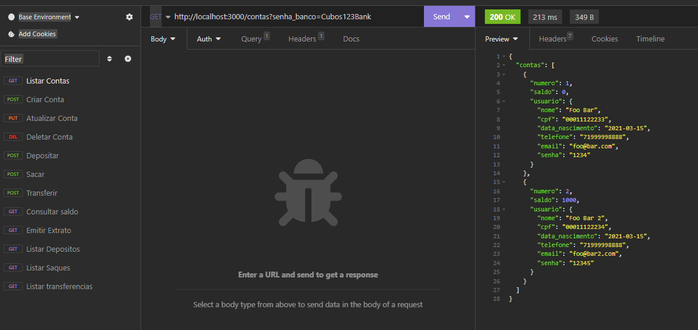
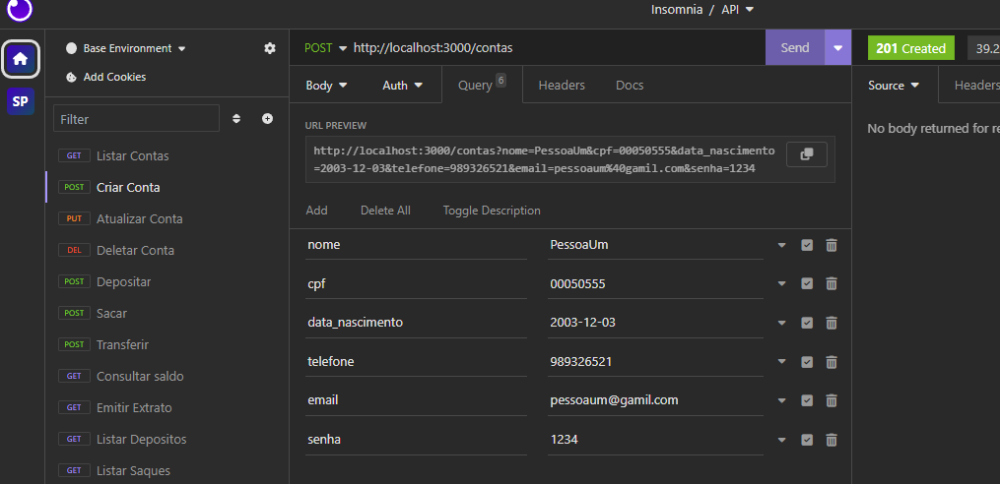
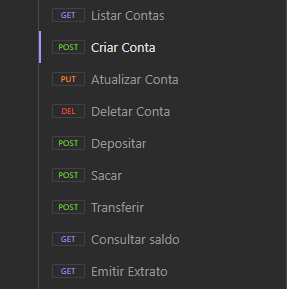

# Sobre o Projeto?

### ⚠️ Importante: Você precisará de um **framework** de testes de API, como: Insomnia, Postman, soapUI etc.

## Descrição 

Aqui usaremos o Insomnia.

A API consiste em simular um sistema bancário onde é possível **criar conta**, **atulizar dados de usuário**, **excluir conta**, **realizar transações** e **emitir um extrato**.

## Persistências dos dados

Os dados serão persistidos em memória, no objeto existente dentro do arquivo `bancodedados.js`.

**Importante: É preciso passar os métodos HTTP corretamente de acordo com as rotas.**

**Exemplo:**

Inicialmente iremos criar uma conta. **Obs: Certifique-se de que o servidor está rodando.**

Perceba que há uma senha passada na Url que necessário para o gerenciamento das contas.

Ao criar uma conta certifique-se que todos os campos foram passados no corpo (body). Caso contrário, retornará um erro.

    Você pode pegar como exemplo a listagem das funções que foram passadas anteriormente no **Insomnia**.

#### Aproveite para usar seus conhecimentos e aprimorar os códigos do projeto.